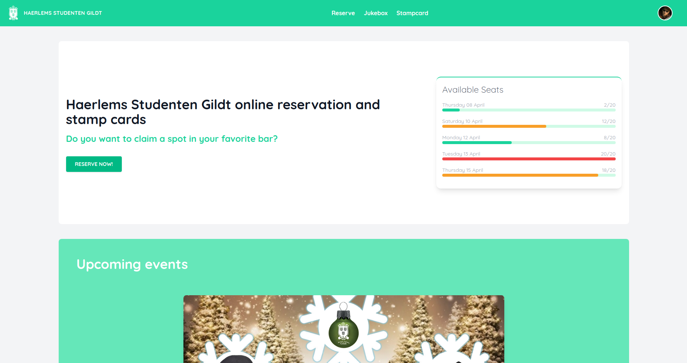

## Haerlems Studenten Gildt online reservation platform

This project is custom made for a local student bar in Haarlem. They needed an online reservation platform during the COVID-19 pandemic to keep track of their guests.

With this platform guests can register, check how many seats are available and reserve a table. When they don't cancel their reservation they automatically receive a loyalty stamp, with those stamps they can claim a free drink when they reach a certain amount of stamps. As a guest you can also request songs in the Jukebox and vote on requests made by other guests.

Bar staff have a clean overview of the upcoming reservations, keep track on the amount of coins\* guests have spent and check out guests when they have paid.

\*_The bar has a coin based payment system but can't hand out physical coins during the pandemic_

## Table of contents

- [Screenshots](#screenshots)
- [Features](#features)
- [Tech](#tech-stack)
- [Lessons](#lessons-learned)
- [Roadmap](#upcoming-features-/-roadmap)
- [Links](#links)
- [Install](#install)

## Screenshots



- [More Screenshots](https://drive.google.com/drive/folders/1HsT6ivmhclyFDBUOT6jJvPuzPAPt0Hex?usp=sharing)

## Features

- Login / Sign up
- Reserve tables
- Check upcoming events
- Request songs "Jukebox"
- Stamp cards
- Edit user profile
- Protected routes for staff
- Staff page with upcoming reservations
- Mobile responsive

## Tech Stack

**Client:** React, TypeScript, Redux, Formik + Yup, Headless UI, Tailwind CSS

**Server:** Node, Express, JWT, Sequelize, PostgreSQL, Joi

## Lessons Learned

What I learned during this project:

- Practice building a MVP in 9 days
- Abstracting code to make small reuseable components in React
- Working with TypeScript
- Custom hooks
- Creating an UI with Tailwind CSS + Headless UI

## Upcoming features / Roadmap

- Upload user avatar
- Ability for guests to cancel their own reservation
- Create new event page for staff and study associations.
- More staff functionalities
- Abstract code into smaller components

## Links

- [Project board](https://github.com/DionAlting/portfolio-frontend/projects/1)
- [Wireframe](https://drive.google.com/file/d/1OejX_buUxH4yMAuVMA9yqSkchwT6GkK6/view?usp=sharing)
- [Database diagram](https://dbdiagram.io/d/6049e497fcdcb6230b23a30b)
- [Backend repo](https://github.com/DionAlting/portfolio-backend)

## Install

Clone the project

```bash
  HTTPS => git clone https://github.com/DionAlting/portfolio-frontend.git
  SSH   => git clone git@github.com:DionAlting/portfolio-frontend.git
```

Go to the project directory

```bash
  cd portfolio-frontend
```

Install dependencies

```bash
  npm install
```

Start the server

```bash
  npm run start
```
